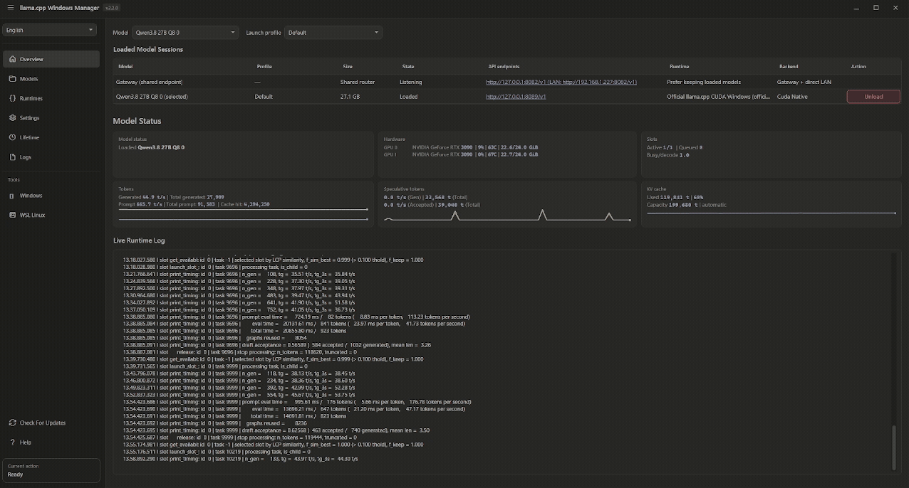

# llama.cpp Windows Manager

Десктопный менеджер для Windows: установка рантаймов `llama.cpp`, организация
GGUF-моделей, сохранение профилей запуска и запуск контролируемых
OpenAI-совместимых endpoint'ов моделей в нативном Windows или Ubuntu/WSL.

> Неофициальный общественный проект. Не связан с `llama.cpp` или `ggml-org`
> и не одобрен ими.

[Скачать последний релиз](https://github.com/MRafStudio/llama-cpp-windows-manager/releases/latest)
· [Читать документацию](docs/DEVELOPMENT.md)
· [Автоматизация через `llwmctl`](docs/CONTROL_API.md)

<p align="center">
  <a href="https://buymeacoffee.com/alekkson">
    
  </a>
</p>



## Зачем нужен llama.cpp Windows Manager?

* **Управляйте `llama.cpp` без ручного ведения команд и процессов.**
* **Запускайте несколько моделей одновременно**, каждая — с сохранёнными
  настройками, выделенным портом и собственным `/v1` endpoint'ом.
* **Выбирайте рантайм для каждого профиля запуска:** нативный Windows или WSL,
  с использованием CPU, CUDA, Vulkan или Intel Arc SYCL.
* **Подключайте OpenAI-совместимые клиенты кодинга и чата** через прямые
  endpoint'ы моделей или единый общий gateway.
* **Автоматизируйте и отслеживайте продвинутые сценарии** с помощью групп
  моделей, транзакционной загрузки, выгрузки по простою, живых метрик, логов
  и аутентифицированного API управления `llwmctl`.

> Выбирайте инструмент, ориентированный на чат, когда важна простота. Выбирайте
> llama.cpp Windows Manager, когда нужен более глубокий контроль, несколько
> управляемых моделей и надёжные локальные endpoint'ы.

## Установка

Скачайте установщик Windows x64 или portable ZIP из
[GitHub Releases](https://github.com/MRafStudio/llama-cpp-windows-manager/releases/latest),
вместе с соответствующим файлом `.sha256`. Релизы автономны (self-contained);
отдельная установка .NET runtime не требуется.

Проверьте загруженный артефакт перед запуском:

```powershell
$asset = "LlamaCppWindowsManager-win-x64.zip"
$expected = ((Get-Content "$asset.sha256" -Raw).Trim() -split "\s+")[0]
$actual = (Get-FileHash $asset -Algorithm SHA256).Hash
if ($actual -ne $expected) { throw "Release checksum mismatch" }
```

- **Установщик:** встроенная установка, пункт в меню «Пуск», поддержка
  обновлений и опциональная задача автозапуска вместе с Windows.
- **Portable ZIP:** без установщика; записываемые данные приложения хранятся
  в папке `data` рядом с `LlamaCppWindowsManager.exe`.
- **Требования:** Windows 10 или 11 x64. GPU-рантаймы также требуют
  совместимых драйверов производителя, а для WSL-бэкендов — рабочего
  окружения Ubuntu/WSL.

Опубликованные артефакты не подписаны, если в описании релиза явно не указано,
что подпись была создана защищённым workflow подписания. Контрольная сумма
(checksum) проверяет целостность файла; она не является гарантией подлинности
издателя.

## Быстрый старт

1. Откройте **Runtimes** и установите готовый рантайм для Windows или WSL.
   Можно также поместить папку с `llama-server` или `llama-server.exe`
   в настроенную папку рантаймов, а затем просканировать или
   зарегистрировать её.
2. Откройте **Models**, чтобы скачать GGUF с Hugging Face или
   зарегистрировать существующую модель. Чтобы добавить модель вручную,
   скопируйте её файл `.gguf` в любое место внутри настроенной папки моделей,
   затем выберите **Scan Models Folder**.
3. Выберите рантайм, настройте параметры запуска и сохраните профиль
   для модели.
4. Откройте **Overview**, выберите модель/профиль и нажмите **Load**.
   Endpoint готов, когда его состояние станет **Loaded**.
5. Направьте OpenAI-совместимый клиент на отображаемый прямой endpoint или
   включите общий gateway в **Settings** и используйте ID модели, возвращаемый
   `GET /v1/models`.

Для инференса модели всегда требуется API-ключ, настроенный в **Settings**.
Ключ защищён для текущего пользователя Windows и передаётся `llama-server`
через его окружение, а не через командную строку. Некоторые сборки llama.cpp
оставляют метаданные работоспособности или каталога моделей публичными;
не считайте такие ответы обнаружения доказательством того, что инференс
не требует аутентификации.

## Профили, группы и компаньоны

Профиль запуска фиксирует для одной модели рантайм, порт, контекст,
выделение GPU, параметры сэмплирования, серверные и мультимодальные опции,
а также опции спекулятивного декодирования. Разовые переопределения не меняют
сохранённый профиль, если не сохранены явно.

Группы назначаются профилям, а не записям моделей. Загрузка группы выполняет
предварительную проверку каждого рантайма, порта, дублирующихся назначений
моделей и суммарных требований к VRAM до запуска любого участника. Политика
удержания управляет автоматической выгрузкой по простою; она не планирует
запросы на инференс.

Автообнаружение компаньонов Vision, draft и MTP намеренно ограничено папкой
основной модели. Явно указанные совместимые пути могут указывать в другие
места. О том, как курируемые и обнаруженные рантаймом опции отображаются
и сохраняются, см.
[Схему параметров запуска](docs/LAUNCH_SETTINGS_SCHEMA.md).

## API управления и `llwmctl`

`llwmctl.exe` — это клиент командной строки для аутентифицированного,
доступного только через loopback API управления Manager'ом (`/api/v1/*`).
Этот API управляет запущенным приложением и отделён от защищённого API-ключом
OpenAI-совместимого gateway и прямых endpoint'ов инференса моделей. Он не
запускает неуправляемые процессы `llama-server`.

```powershell
llwmctl status
llwmctl capabilities
llwmctl self
llwmctl models list
llwmctl runtimes list
llwmctl profiles list --model <model>
llwmctl load <model> --profile <profile> --wait
llwmctl sessions inspect <session>
llwmctl gateway inspect
llwmctl sessions metrics <session>
llwmctl sessions logs <session>
```

Инструменты автоматизации должны прочитать [AGENTS.md](AGENTS.md) перед
работой с приложением. Полные контракты команд и HTTP описаны в
[Локальный API управления и `llwmctl`](docs/CONTROL_API.md).

## Безопасность и данные

- API управления Manager'ом работает только через loopback
  и аутентифицируется независимо.
- Раздача моделей по умолчанию ограничена loopback. Доступ gateway и прямых
  портов из LAN — отдельные явные настройки.
- Критичные для безопасности аргументы `llama-server` (host, port, API-ключ)
  нельзя подменить через пользовательские параметры запуска.
- Нативные дочерние процессы привязаны к Windows Job Object, поэтому они
  завершаются при неожиданном выходе из Manager'а.
- Загрузки и обновления проверяют размеры, контрольные суммы (когда они
  предоставлены), имена файлов и пути в архиве до установки.
- Восстановление установщика, обновление и обычное удаление сохраняют данные
  приложения, если удаление данных не выбрано явно.

Portable-данные обычно хранятся в папке `data` рядом с исполняемым файлом.
Если это место недоступно для записи, приложение использует
`%LocalAppData%\llama.cpp Windows Manager`. Задайте
`LLAMA_CPP_WINDOWS_MANAGER_WORKSPACE` до запуска, чтобы выбрать другое
рабочее пространство.

## Разработка

Для разработки из исходников требуются Windows 10/11 x64, PowerShell 5+
и .NET 10 SDK, выбранный в `global.json`. Inno Setup 6 требуется только
для сборки установщика.

```powershell
powershell.exe -NoProfile -ExecutionPolicy Bypass -File .\scripts\build-app.ps1 -Restore
powershell.exe -NoProfile -ExecutionPolicy Bypass -File .\scripts\test-release-gate.ps1
```

Добавьте `-IncludePublish` для проверки portable-пакета и `-IncludeInstaller`
на машине с настроенным Inno Setup. Сгенерированные `bin`, `obj`,
`TestResults`, `dist`, логи, локальные рабочие пространства, базы данных
и файлы моделей игнорируются Git. Используйте `scripts/clean-repo.ps1` для
удаления сгенерированных результатов.

Создайте установщик напрямую с помощью `scripts/build-installer.ps1` после
настройки Inno Setup и, для доверенных релизов, сертификата подписания.

Подробности об архитектуре и вкладе — в
[Руководстве разработчика](docs/DEVELOPMENT.md) и
[Контракте архитектуры](docs/ARCHITECTURE.md).

## Документация

- [Готовность релиза](docs/RELEASE_READINESS.md)
- [Установщик Windows](docs/INSTALLER.md)
- [Подписание релизов](docs/SIGNING.md)
- [Локальный API управления](docs/CONTROL_API.md)
- [Аудит усиления безопасности релиза](docs/AUDIT.md)

## Лицензия

Распространяется по [лицензии MIT](LICENSE). Включённые зависимости сохраняют
собственные лицензии; см. [уведомления третьих сторон](THIRD-PARTY-NOTICES.md).
