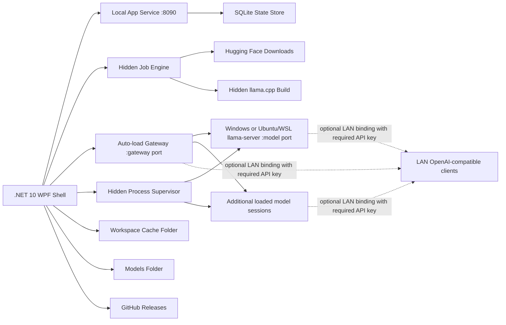

# Целевая архитектура

Последняя ревизия: 2026-08-15

## Границы

Целевой релиз ориентирован в первую очередь на Windows и автономен для UI: llama.cpp работает либо как нативный Windows-процесс `llama-server.exe`, либо внутри Ubuntu/WSL. Репозиторий владеет кодом и управлением процессами:

- оболочка (shell) рабочего стола на .NET 10 WPF
- единственный экземпляр приложения на сеанс пользователя Windows
- локальный сервис приложения с токеном аутентификации на сеанс
- сериализованное хранилище состояния SQLite
- скрытый супервизор процессов для нативного Windows или Ubuntu/WSL `llama-server`
- обслуживание моделей только локально по умолчанию; для инференса требуется API-ключ, предусмотрено ограниченное (scoped) предоставление доступа по LAN для портов gateway и/или прямых портов моделей; метаданные upstream о здоровье сервиса или каталоге могут оставаться публичными
- скрытые задания по пакетам рантайма / сборке из исходников / загрузкам
- детекторы окружения Windows и WSL/Linux и лаунчеры настройки
- проверка обновлений GitHub Releases с поэтапной установкой portable-exe
- PowerShell-скрипт сборки — только когда пользователь сам запускает сборку
- кэш и временные папки для промежуточных файлов, принадлежащие приложению

Репозиторий по умолчанию не владеет большими данными:

- модели GGUF
- скачанные/распакованные сборки llama.cpp

Рабочая область (workspace) фиксирована для процесса и по умолчанию равна `data` рядом с `LlamaCppWindowsManager.exe`, если это расположение доступно для записи. В противном случае выполняется откат к `%LocalAppData%\llama.cpp Windows Manager`; папки `%LocalAppData%\llama.cpp Console` и `%LocalAppData%\LocalLlmConsole` переиспользуются только в том случае, если они уже существуют. Рабочую область можно переопределить переменной `LLAMA_CPP_WINDOWS_MANAGER_WORKSPACE` до запуска; `LLAMA_CPP_CONSOLE_WORKSPACE` и `LOCAL_LLM_CONSOLE_WORKSPACE` по-прежнему принимаются как устаревшие (legacy) псевдонимы. Модели и рантаймы настраиваются в настройках приложения (App Settings) и хранятся в SQLite. Данные кэша находятся внутри фиксированной рабочей области и не выделяются в отдельную папку настроек. Исходное дерево содержит WPF-приложение, управляющий CLI `llwmctl`, тесты, документацию и вспомогательный скрипт для сборок llama.cpp. Релизные сборки встраивают CLI и операторские/управляющие sidecar-компоненты в исполняемый файл приложения и при запуске восстанавливают рядом с ним проверенные копии.

## Структура рантайма

## Состояние и восстановление

Текущее состояние:

1. Операции SQLite сериализованы внутри `StateStore`, поэтому таймеры UI, загрузки и чтения через локальный API не используют одно соединение одновременно.
2. Миграции схемы применяются идемпотентно и фиксируются в таблице `migrations`.
3. Сохранение настроек транзакционно.
4. Повреждённые строки настроек сохраняются в резервную копию под `state\corrupt-settings` и заменяются значениями по умолчанию.
5. Повреждённые файлы баз данных помещаются в карантин под `state\corrupt-database-*` и пересоздаются при запуске.
6. При запуске корень рабочей области остаётся неизменным (immutable) для запущенного процесса.
7. Завершённые обновления приложения записывают ожидающее уведомление в кэш рабочей области, чтобы перезапущенное приложение могло показать заметки о выпуске и затем удалить уведомление.
8. Определения модельных групп и назначения профилей запуска заменяются в одной транзакции SQLite; сбой ограничения или записи оставляет предыдущий снимок группы нетронутым.

## Архитектурный контракт

Завершённая архитектура означает, что функциональность можно изменять через её модуль, границу приложения/рабочего процесса, UI-слой страницы и целевые тесты, не добавляя новое поведение в `MainWindow` и не угадывая, какой сервис владеет решением.

Направление зависимостей сознательно одностороннее:

1. Композиционные корни (`AppServiceFactory*` и `MainWindowServices`) создают и группируют сервисы. `AppServiceFactory` разделён по стадиям жизненного цикла: инфраструктурные сервисы, базовые сервисы оболочки, загруженные сервисы на базе БД, хелперы каталога, фундаментальные хелперы, хелперы рантайма и хелперы модельного рантайма/gateway. Они не владеют поведением функциональности.
2. `MainWindow` — это оболочка: навигация, время жизни приложения, обёртки выполнения на переднем/заднем плане, размещение страниц и применение конечных результатов UI.
3. Контроллеры страниц адаптируют события WPF и состояние страницы к сервисам приложения. Они могут координировать выбор, таймеры и повторную входимость (reentrancy) для страницы, но не должны владеть доменными правилами.
4. Фабрики страниц создают только элементы управления WPF. Они не должны вызывать доменные, рабочие (workflow), хранилищные, процессные, сетевые сервисы или сервисы настроек.
5. Классы состояния страниц хранят ссылки на элементы управления WPF и применяют простое визуальное состояние. Они не должны принимать бизнес-решения, выполнять ввод-вывод или вызовы сервисов.
6. View-модели владеют наблюдаемыми строками, выбранными элементами, текстом статуса/занятости и детерминированной проекцией строк. Они не должны запускать процессы, трогать файлы или вызывать удалённые API.
7. Сервисы приложения адаптируют доменные/рабочие результаты к действиям, обращённым к UI: индикаторы занятости, подтверждения, обновления статуса, обновления данных и выделение. UI-колбэки принадлежат этой границе, а не доменным сервисам.
8. Сервисы рабочих процессов владеют многошаговыми асинхронными потоками, заданиями, последовательностями внешних команд и поведением восстановления/повторов. Они возвращают планы/результаты и остаются независимыми от элементов управления WPF.
9. Доменные сервисы владеют чистыми решениями и правилами, специфичными для функциональности. Они должны возвращать записи, планы, строки или результаты валидации вместо мутации UI.
10. Инфраструктурные сервисы владеют примитивами ОС, файловой системы, процессов, хранилища, HTTP, безопасности, форматирования и диалогов. Они не должны кодировать политику функциональности за пределами своей узкой границы.

Имена сервисов должны описывать право собственности:

- `*ApplicationService`: UI-ориентированная композиция рабочих процессов и упорядочивание побочных эффектов через явные действия.
- `*WorkflowService`: многошаговый поток домена/процессов/заданий.
- `*Controller`: координация страницы/UI с состоянием, таймеры, повторная входимость или маршрутизация событий.
- `*Factory`: создание элементов управления, сервисов или неизменяемых объектов запросов.
- `*State`: ссылки на элементы управления или состояние страницы/сеанса без бизнес-правил.
- Простой `*Service`: сфокусированное доменное или инфраструктурное поведение.

Разделение и объединение должны следовать ответственности, а не эстетике. Добавляйте новый тип, когда он владеет реальным решением, конечным автоматом, внешней границей, набором зависимостей или повторяющимся поведением, которые иначе размыли бы модуль. Разделяйте файл, когда у него несколько устойчивых причин для изменения или несколько независимо тестируемых политик. Объединяйте или удаляйте транзитные (pass-through) сервисы, которые лишь пересылают вызовы, не добавляя политики, валидации, состояния, адаптации или защиты границ.

Тесты должны в первую очередь защищать поведение. Тесты формы исходного кода допустимы только для устойчивых архитектурных ограничений: направления зависимостей, размещения модулей, композиции сервисов и намеренного отсутствия прямой связанности с `MainWindow` или WPF. Они не должны замораживать случайные строки реализации, когда правило можно выразить поведенческим тестом.

## Текущие границы сервисов

Окно WPF намеренно является оболочкой: время жизни приложения, навигация оболочки, брокеридж событий и применение конечных результатов UI остаются там. Переиспользуемое поведение разделено на сервисы функциональности, сервисы рабочих процессов/приложения, view-модели, состояние страниц и контроллеры страниц. Связывание запуска/остановки остаётся в `MainWindow.xaml.cs`; поля оболочки и держатели жизненного цикла загруженных сервисов — в `MainWindow.State.cs`; маршрутизация строк/событий страниц живёт за контроллерами страниц там, где страница имеет значимую связку действий.

Зависимости `MainWindow` сгруппированы по владельцу. Базовые сервисы читаются через именованные наборы (bundles) (`App`, `Ui`, `Models`, `Runtime`, `HuggingFaceServices` и `Environment`), а загруженные сервисы — через их наборы после запуска (`App`, `Models`, `Gateway` и `Runtime`). Эти записи-наборы намеренно не предоставляют плоских транзитных псевдонимов; граф зависимостей должен читаться по модулям.

Файлы сервисов сгруппированы по функциональности, а не лежат в одной плоской папке. Папка верхнего уровня `Services` зарезервирована для композиции/корневого связывания (`AppServiceFactory*` и `MainWindowServices`), тогда как код реализации живёт в `Services/App`, `Services/Environment`, `Services/Gateway`, `Services/HuggingFace`, `Services/Infrastructure`, `Services/Models` и `Services/Runtimes`. UI-фабрики и состояние страниц аналогично сгруппированы в `Ui/Common` и `Ui/Pages/*`; крупные UI-фабрики, такие как `LaunchSettingsPanelFactory`, разделены на оболочку, композицию секций, фабрики элементов управления, меню выбора и хелперы разметки. `ModelGroupDialogFactory` аналогично разделён на partial-части менеджера, назначения, редактора и общих хелперов. Текущий код сохраняет стабильные file-scoped пространства имён; сужение пространств имён может выполняться по модулям, если это даёт явную пользу.

- `MainWindowViewModel` и view-модели страниц (`OverviewPageViewModel`, `ModelsPageViewModel`, `RuntimesPageViewModel`, `RuntimePackagesPageViewModel`, `RuntimeBuildsPageViewModel`, `RuntimeMetricsViewModel`, `WindowsPageViewModel`, `WslLinuxPageViewModel`, `HuggingFacePageViewModel`, `JobsViewModel`, `LogsViewModel`, `SettingsPageViewModel`, `LaunchSettingsViewModel`, `UpdatesPageViewModel` и `LifetimeMetricsViewModel`) владеют коллекциями строк, списками выбора, состоянием статуса/занятости и детерминированной проекцией строк для мигрированных страниц.
- `LocalControlApi`, `LocalControlDiscoveryService` и `llwmctl` владеют версионированной поверхностью автоматизации через loopback, обнаружением endpoint/токена текущего пользователя, безопасной самоидентификацией моделей, полными типизированными патчами настроек, инспекцией endpoint без раскрытия секретов и структурированным выводом команд. `ControlAppSettingsMutationService` владеет нормализацией настроек управляющей поверхности, защитой защищённых полей, обязательной валидацией API-ключа и проверками конфликтов портов в реальном времени. `ControlRuntimeOperationApplicationService` владеет диспетчеризацией операций с пакетами рантайма/исходниками/сборками/заданиями и компонует существующие сервисы приложения рантайма, не размещая эти рабочие процессы в `MainWindow`. `ControlRequestAdmissionService` применяет правила самосохранения, а `ControlOperationCatalog` предоставляет машинные и прикладные операции. `ControlApiAuditLogService` пишет ограниченный журнал аудита запросов, содержащий только метод, путь, статус результата и длительность; `LogFileService` показывает его на странице Logs как тип **Control API**. Управляющие действия переиспользуют те же сервисы моделей/рантайма и отправляют синхронизацию UI через мост оболочки.
- `StateStore`, `ModelGroupService`, `OverviewModelGroupLoadPlanningService`, `OverviewModelGroupLoadApplicationService`, `JobEngine` и `SecretProtector` владеют долговечным состоянием, транзакционной заменой групп профилей запуска, валидированной политикой членства/хранения, планированием загрузки групп и откатом, заданиями, защищёнными настройками и валидацией сохранённых переходов заданий. Наблюдаемый (supervised) сеанс определяет политику через сохранённый ID профиля запуска, что позволяет профилям одной модели различаться. Устаревшие назначения на уровне моделей мигрируют в профиль модели по умолчанию. Загрузка группы валидирует полный план рантайма/портов/агрегированной VRAM до запуска первого члена, останавливает все сеансы, которые необходимо заменить перед переключением портов, и восстанавливает исходные сеансы, если какой-либо целевой не запустился. Приоритет вытеснения группы ранжирует только автоматических кандидатов на выгрузку по простою; это не планировщик инференса.
- `ModelCatalogService`, `HuggingFaceService`, `HuggingFaceInstallStateService`, `HuggingFaceLaunchSettingsSuggester` и `ModelCapabilityService` владеют обнаружением моделей, жизненным циклом загрузок, поиском компаньонов точной папки модели, приоритетом встроенных NextN/MTP, типобезопасной классификацией MTP/DFlash/DSpark/Eagle3/draft, загрузкой подходящих компаньонов mmproj/projector, состоянием кнопок установки/загрузки, подсказками запуска из README и выводом о возможностях локальных моделей. Разбор предложений запуска Hugging Face разделён на разбор конфигурационного JSON, извлечение команд из README, токенизацию shell и сопоставление опций.
- `RuntimeRegistryService`, `RuntimeAdapter`, `RuntimeLaunchOptionSwitchService`, `RuntimeDeletionPlanner`, `RuntimeDeletionExecutorService`, `RuntimePackageSourceCatalog`, `RuntimePackageReleaseClient`, `RuntimePackageAssetSelector`, `RuntimePackageInstallFileService`, `RuntimePackageInventoryPresenter`, `RuntimeBuildCatalogService`, `RuntimeBuildJobService`, `RuntimeBuildToolService`, `RuntimeMetadataService`, `RuntimeEquivalenceService`, `RuntimeFileService`, `RuntimePortAllocator`, `ModelPortAllocator` и `RuntimeEndpointService` владеют обнаружением рантаймов, валидацией запуска, объявленным спариванием положительных/отрицательных переключателей, планированием удаления, выполнением удаления, выбором источника/канала готовых пакетов, разбором релизов, сопоставлением ассетов, распаковкой/простановкой метаданных, проекцией инвентаря пакетов, метаданными каталога исходников/сборок и разбором remote-ref, построением команд инструментов сборки, эквивалентностью исходных/готовых сборок, безопасными границами удаления, URL серверов моделей, стабильными портами на модель и сопоставлением обслуживаемых моделей.
- `LlamaProcessSupervisor`, `NativeRuntimeStopService`, `LlamaRuntimeOutputObserver`, `TrackedProcessRunner`, `WindowsEnvironmentService`, `WindowsSetupCommands`, `WslEnvironmentService`, `WslSetupCommands` и `CommandLineService` владеют супервизией процессов, проверкой остановки нативных процессов, наблюдением за stdout/stderr рантайма, выполнением отслеживаемых процессов, разбором обнаружения/статуса/проб инструментов Windows и WSL, командами настройки/проб и экранированием/запуском видимых shell-команд.
- `RuntimeMetrics`, `RuntimeDashboardService`, `GpuStatusService`, `LogFileService`, `FileSystemSafetyService`, `VramAdmissionService` и `CacheMaintenanceService` владеют разбором метрик, вычислениями живого дашборда рантайма, сводками GPU CUDA/NVIDIA, идентификацией Intel SYCL, не зависящими от вендора резервными сводками GPU Windows, предпросмотром/классификацией/редактированием/планированием удаления логов, общими защитными ограничениями файловой системы, консервативным допуском мультимодельной VRAM и безопасностью очистки кэша.
- `AppPreferenceService`, `DisplayFormatService`, `LaunchSettingMetadataService`, `LoadedModelSessionManager`, `ActiveRuntimeSessionStore`, `ModelRuntimeStatusTracker`, `ModelRuntimeStatusController`, `ModelRuntimeStatusRenderService`, `AppUpdateService`, `AppUpdateReleaseParser` и `AppUpdateAssetVerifier` владеют нормализацией опций настроек, общим форматированием значений UI, текстом опций/справки/подсказок настроек запуска, состоянием загруженных сеансов в памяти, состоянием восстановления работающего рантайма, таймингом переходного статуса загрузки/загруженности модели, отображением сохранённой длительности завершённой загрузки, обновлениями GitHub Releases, выбором ассетов релиза/разбором версий и проверкой контрольных сумм обновлений.
- `HelpCatalogService` владеет компактным каталогом статей-задач, выбором секций, локализованной проекцией статей, детерминированным поиском по темам и ранжированием результатов. `HelpPageController`, `HelpPageState`, `HelpPageFactory` и `HelpResultsFactory` владеют взаимодействием поиска по справке, визуальным состоянием, композицией страницы, раскрывающимися карточками результатов и контекстной навигацией, не размещая поведение справки в `MainWindow`.
- `EndpointInspectionService` выполняет доступную только для чтения аутентифицированную живую инспекцию прямых endpoints моделей (`/health`, `/v1/models`, `/props` и `/slots`) и общего gateway (`/health`, `/v1/models` и `/running`). Он сохраняет частичные результаты, когда ответвление (fork) не предоставляет необязательный endpoint. `EndpointInspectionDialogFactory` отображает нормализованные результаты без отправки запросов на инференс; его полная поверхность и диалоги Model Groups используют тот же контракт локализации на 21 языковой пакет, что и оболочка.
- `OverviewPageState` применяет сохранённые предпочтения видимости UI к отдельным карточкам метрик и строкам лога/сырых метрик и оценивает состояние действий выбранной модели/профиля так, что Load подавляется только когда запущенный профиль запуска совпадает с выбранным; `ModelsPageState` делает то же для строки Hugging Face. Они сворачивают связанное пространство сетки и разделители, оставляя сервисы наблюдения за рантаймом и загрузок активными. `SettingsPageDefinitionService` проецирует девять булевых значений в компактную категорию **UI**, `AppSettingsUpdateService` валидирует значения редактора Show/Hide, а `StateStore.Settings` явно читает и пишет каждый ключ SQLite. Дебаунс-уведомление об изменении `SettingsPageState` сохраняет корректные правки и повторно применяет состояние страницы без пересборки сфокусированного редактора. Отсутствующие ключи используют документированные значения по умолчанию для каждой поверхности. Типизированная схема элементов управления `AppSettings` автоматически предоставляет те же поля.
- `ModelGatewayService`, `ModelGatewayRequestAccessPolicy`, `ModelGatewayRequestResolver`, `ModelGatewayUpstreamProxy`, `ModelGatewayResponseWriter`, `GatewayModelLoadWorkflowService`, `GatewayRuntimeApplicationService`, `GatewayActivityStatusTracker` и `GatewayActivityStatusController` владеют общим роутером автозагрузки, проверками доступа/CORS, разрешением id модели, проксированием upstream, полезными нагрузками ответов для клиентов, рабочим процессом загрузки с учётом политики, ошибками загрузки для клиентов и статусом маршрутизации в Overview.

Крупнейшие классы сервисов также разделены по зонам ответственности: `StateStore` разделяет каталог, политику модельных групп, настройки, сохранение заданий и миграцию устаревших значений запуска по умолчанию; `HuggingFaceService` разделяет поиск, жизненный цикл загрузок, проверку безопасности, обработку компаньонов projector и предложения профилей запуска; `LlamaProcessSupervisor` разделяет жизненный цикл рантайма, хелперы запуска и хелперы очистки WSL; `RuntimeBuildCatalogService` разделяет пресеты по умолчанию, сохранение пользовательских репозиториев, метаданные скачанных исходников, представление строк пресетов и хелперы идентичности backend/режима; `RuntimeMetadataService` разделяет чтение метаданных пакетов, вывод пресетов, хелперы коммитов и хелперы путей папок/пакетов рантайма; `ModelGatewayService` делегирует политику доступа, разрешение запросов/моделей, проксирование upstream и полезные нагрузки ответов хелперам gateway; `RuntimeDeletionPlanner` разделяет планирование прямого рантайма, пакетов, кэша исходников и пресетов сборок, тогда как `RuntimeDeletionExecutorService` выполняет мутацию состояния/файловой системы; `AppUpdateService` делегирует разбор релизов и проверку контрольных сумм хелперам обновлений; а `ModelCatalogService` держит устаревший разбор метаданных отдельно от обычных потоков сканирования/импорта/удаления.

Доменные модели сгруппированы по использованию, а не лежат в одном файле «всё включено»: базовые records/enums, значения приложения по умолчанию, настройки запуска на модель и полезные нагрузки запуска рантайма/загрузок имеют отдельные файлы моделей. Фоновые обновления и мониторы `MainWindow` проходят через общую обёртку `RunBackground`, чтобы сбои логировались и отображались в строке статуса, а не становились ненаблюдаемыми задачами.

`ApplicationThemeService` владеет динамической заменой ресурсов приложения и обнаружением системной темы. `VisualTreeTraversal` и `UiAccessibility` предоставляют общие хелперы обхода дерева WPF и автоматизации. `MainWindow` больше не содержит дублирующих фабрик страниц, фабрик метрик, палитр тем или рабочих процессов управления рантаймом, и каждая partial-часть оболочки ограничена архитектурным тестом.

## Жизненный цикл обновления приложения

Текущее состояние:

1. Пункт навигации Updates расположен ниже Logs и по умолчанию показывает **Check For Updates**.
2. При запуске в фоне проверяется настроенная лента GitHub Releases. Когда найдена более новая версия, пункт навигации меняется на **Install Update**.
3. Ручные проверки показывают либо всплывающее окно «обновлений нет», либо подтверждение установки.
4. Установка скачивает ассет релиза в `cache\app-updates`, распаковывает portable-файлы, если ассет — zip, запускает скрытый сценарий передачи управления PowerShell, закрывает приложение, подготавливает и проверяет соседние файлы приложения/CLI, атомарно заменяет оба с резервными копиями для отката и перезапускается только после полного успеха замены.
5. Перед распаковкой требуется и проверяется соответствующий SHA-256 компаньон-ассет.
6. Если установленное приложение подписано, подготовленный исполняемый файл обновления должен быть подписан тем же сертификатом до замены.
7. Перезапущенное приложение показывает имя и заметки релиза GitHub из установленного обновления.

Ещё требуется:

1. Подписывать ассеты релиза перед загрузкой на GitHub.
2. Публиковать SHA-256 компаньон-ассеты для пакетов обновлений.

## Жизненный цикл модели

Текущее состояние:

1. Выбрать папку моделей или просканировать её по запросу.
2. Автоматически регистрировать отсутствующие папки моделей GGUF в SQLite.
3. Выбрать готовый или собранный вручную рантайм llama.cpp и настройки запуска.
4. Явная загрузка/перезапуск/выгрузка; одновременно могут оставаться загруженными несколько моделей, если у каждой модели уникальный сохранённый порт и позволяет ёмкость оборудования.
5. Искать Hugging Face со страницы Models, вставлять URL репозитория Hugging Face или GGUF-файла напрямую, просматривать сигналы совместимости, открывать карточку выбранного репозитория и скачивать/устанавливать выбранный GGUF вместе с обнаруживаемым проверенным компаньоном mmproj/projector как фоновое задание.
6. Удалять регистрацию или принадлежащую приложению директорию модели в соответствии с флагами владения.
7. Формировать компактные манифесты моделей из читаемых метаданных GGUF, сохраняя импортированные/скачанные метаданные.
8. Проверять ожидаемое количество байт или SHA-256 перед регистрацией скачанных GGUF-файлов.
9. Валидировать локальное сочетание vision/projector: отображать отсутствующие файлы mmproj в сводках возможностей, инвалидировать кэшированные возможности при добавлении или удалении projector, учитывать автоматически обнаруженный, встроенный/входящий в комплект модели или явный выбор Vision head на модель, учитывать отдельный путь MTP head для совместимых рантаймов `--mtp-head` и передавать в `llama-server` допустимые количества токенов изображений с динамическим разрешением на модель.
10. Сохранять именованные варианты запуска на модель, чтобы пользователи могли хранить несколько профилей рантайма/порта/контекста/vision без дублирования регистрации модели.
11. Держать обслуживание моделей локальным, если Settings явно не включает доступ по LAN. Доступ по LAN может ограничиваться gateway автозагрузки, прямыми портами моделей или обоими. Все запуски требуют API-ключ; доступ по LAN открывает только endpoints обслуживания моделей, а не локальный управляющий API приложения.
12. Показывать прогресс загрузки модели в Overview отдельными строками имени модели и времени загрузки и сохранять длительность завершённой загрузки после достижения готовности, чтобы пользователи видели, сколько занял запуск.
13. Считать видимость UI только состоянием представления. Сворачивание карточек, логов, сырых метрик или элементов управления Hugging Face никогда не должно отключать сбор данных, загрузки или обслуживание моделей. Отсутствующие ключи используют документированные значения по умолчанию для каждой поверхности.

Маршрутизация gateway:

- Gateway автозагрузки слушает один OpenAI-совместимый порт `/v1` и сам никогда не обслуживает процесс модели.
- `GET /v1/models` предоставляет по одному маршруту для каждого сохранённого профиля запуска. Профиль по умолчанию сохраняет зарегистрированный id модели и существующие псевдонимы моделей; нестандартные профили получают детерминированные id маршрутов, выводимые из модели и сохранённого id профиля. Коллизии нормализации получают стабильный хэш-суффикс, чтобы ни один профиль не исчезал из обнаружения.
- Каждый запрошенный профиль по-прежнему запускается на своём сохранённом прямом порту рантайма. Gateway сопоставляет запрошенный маршрут с парой модель/профиль, гарантирует, что именно этот профиль загружен, затем проксирует запрос на этот прямой порт. Запрос другого профиля для уже работающей модели останавливает этот сеанс и перезапускает его с запрошенным профилем. Параллельные запросы активного профиля остаются параллельными, пока другой профиль не встанет в очередь; поставленные в очередь группы профилей затем получают приоритет FIFO, чтобы непрерывный трафик активного профиля не мог заморить голодом переключение. Запросы разных моделей остаются параллельными.
- `Prefer keeping loaded models` оставляет существующие сеансы работающими и использует консервативный допуск VRAM перед добавлением ещё одной модели на GPU. `Single active model` выгружает другие прямые сеансы перед загрузкой запрошенной модели.
- Сторонние клиенты узнают текущие маршруты профилей из `GET /v1/models`; Manager не обнаруживает и не редактирует конфигурацию клиентов.
- Overview показывает gateway как строку роутера в Loaded Model Sessions, чтобы пользователи видели общий endpoint, политику маршрутов, доступ по LAN и текущее количество прямых сеансов в том же месте, что и загруженные модели.
- Строки загруженных сеансов открывают живую инспекцию endpoint двойным кликом по строке и кликом по ссылке endpoint. Прямые отчёты различают значения по умолчанию, сообщаемые endpoint, и состояние активных слотов; отчёты gateway не выдумывают единый глобальный контекст или конфигурацию рассуждений, потому что эти значения принадлежат маршрутизируемому профилю модели.

Ещё требуется:

1. Добавить более богатые средства отката для установленных сборок рантайма.

## Жизненный цикл рантайма llama.cpp

Текущее состояние:

1. Сначала устанавливайте готовые пакеты рантайма llama.cpp из Runtime Downloads. Текущие пресеты покрывают официальные CUDA Windows, CUDA WSL, Vulkan Windows, Vulkan WSL, Intel Arc SYCL Windows, Intel Arc SYCL WSL, CPU Windows, CPU WSL, а также позиции Atomic TurboQuant CUDA Windows и Atomic TurboQuant CUDA WSL, когда их источники пакетов публикуют подходящие ассеты.
2. Сканировать настроенные корни рантайма и регистрировать папки, содержащие `llama-server` или `llama-server.exe`.
3. Выбирать рантайм для каждой модели и сохранять стабильный порт модели рядом с этим рантаймом в настройках запуска модели.
4. Отменять регистрацию неиспользуемых рантаймов; удаление файлов рантайма отключено, когда рантайм активен или на него ссылаются сохранённые настройки запуска модели.
5. Согласовывать официальные рантаймы из исходников и готовые по отпечатку рантайма, когда их бинарники совпадают.
6. Собирать llama.cpp для CPU, CUDA, Vulkan или SYCL для нативного Windows или Ubuntu/WSL через конечный автомат строки Runtime Downloads: Check source, Download, затем Build. Репозитории только с исходниками и пользовательские используют одну таблицу, а задания остаются видимыми для отслеживания прогресса и восстановления.
7. Удалять скачанные папки исходников/сборок только при нахождении в границах настроенной папки рантаймов. Сборки, запущенные из таблицы Runtime Downloads, принудительно очищают скачанные исходники после успеха, чтобы строка сбрасывалась в Check; низкоуровневые управляющие операции сохраняют явную настройку очистки.
8. Фильтровать инвентари доступных для скачивания и установленных рантаймов по вендору (AMD/Vulkan, Intel/SYCL, NVIDIA/CUDA) и платформе (Windows или Linux/WSL), при этом позиции CPU остаются в нефильтрованном инвентаре.
9. Отменять активные задания сборки рантайма, повторять неудачные/отменённые/прерванные задания сборки, очищать записи/логи завершённых заданий сборки и показывать последний прогресс из лога сборки в сводке задания.
10. Обнаруживать установленные дистрибутивы WSL на странице WSL Linux, игнорируя дистрибутивы WSL под управлением Docker.
11. Выбирать дистрибутив Ubuntu, используемый для запусков/сборок в WSL.
12. Открывать видимые команды настройки для инструментов Windows CPU/CUDA/Vulkan/Intel oneAPI, установки WSL, обновления WSL, установки Ubuntu, установки инструментов сборки CPU в Ubuntu, установки Ubuntu CUDA Toolkit, установки инструментов Vulkan в Ubuntu, установки рантайма Intel GPU в Ubuntu, установки Intel oneAPI в Ubuntu и проверок обновлений пакетов Ubuntu.
13. Устанавливать зависимости сборки CPU внутри Ubuntu (`git`, `cmake`, инструменты компилятора, pkg-config, заголовки libcurl, ccache, Ninja) по запросу.
14. Считать CUDA отдельным действием настройки WSL: устанавливать WSL CUDA Toolkit от NVIDIA по запросу и проверять наличие CUDA Toolkit перед началом CUDA CMake-сборки.
15. Считать Vulkan отдельным действием настройки: устанавливать пакеты Vulkan Ubuntu, необходимые официальным сборкам llama.cpp (`libvulkan-dev`, `glslc`, `spirv-headers`, `vulkan-tools`, `mesa-vulkan-drivers`), и проверять `vulkaninfo --summary` перед началом Vulkan CMake-сборки.
16. Считать Intel Arc SYCL отдельным действием настройки: проверять инструменты oneAPI Windows для нативных запусков/сборок и рантайм Ubuntu Level Zero/OpenCL плюс инструменты oneAPI DPC++/MKL/DNNL для запусков/сборок в WSL.
17. Обнаруживать наличие инструментов сборки Windows CPU/CUDA/Vulkan/SYCL на странице Windows и инструментов сборки WSL CPU/CUDA/Vulkan/SYCL на странице WSL Linux.
18. Держать пресеты рантайма Windows и WSL раздельными, чтобы скачивания пакетов, скачивания исходников, проверки обновлений, задания сборок, повторы и действия удаления всего не смешивали нативные и WSL-артефакты.

Ещё требуется:

1. Расширить значки совместимости рантаймов за пределы текущих проверок предварительных условий сборки.
2. Добавить более богатые средства отката для установленных пакетов/сборок рантайма.

## Архитектурные ограничения (guardrails)

Кодовая база должна продолжать развиваться по модулям функциональности, а не возвращаться к большим файлам.

- Держать `MainWindow` сфокусированным на времени жизни приложения, навигации оболочки, брокеридже событий и статусе верхнего уровня.
- Держать сырые элементы управления WPF сгруппированными за объектами состояния страниц.
- Держать маршрутизацию строк/событий страниц в контроллерах или презентерах страниц, когда страница получает нетривиальную связку действий.
- Держать `MainWindowCoreServices` и `MainWindowLoadedServices` как записи наборов функциональности без плоских транзитных псевдонимов.
- Держать типичные сервисы функциональности в их владеющем модуле сервисов, вместо того чтобы полагаться на поиск по имени файла для скрытия случайных перемещений.
- Держать имена файлов реализации сервисов и UI уникальными во всех модулях, чтобы тесты, ревью и будущие перемещения не могли стать неоднозначными только по имени файла.
- Объединять транзитные пары `ApplicationService`/`WorkflowService`, когда обёртка не владеет реальной UI-адаптацией, решением, состоянием или границей.
- Предпочитать поведенческие тесты и тесты-ограничители границ модулей хрупким тестам, которые проверяют точный текст исходников в конкретных файлах.
